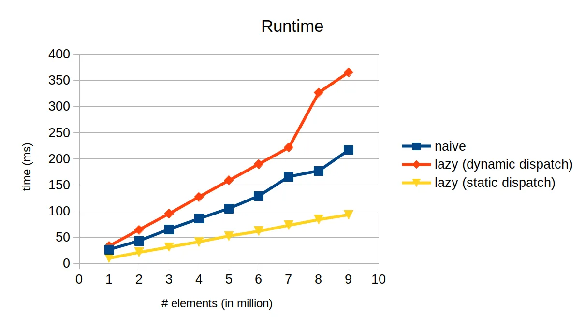

# Expression Template
Simple demo of expression template technique in c++

## Requirement
- python with numpy
- clang or gcc

## How to run
```bash
bash run_benchmark.sh
```

This produces `result.tsv` file, which summarizes the runtime of `naive`, `lazy`, and `expr template` implementations for adding 10 vectors.

## Benchmark Result on linux-x64

